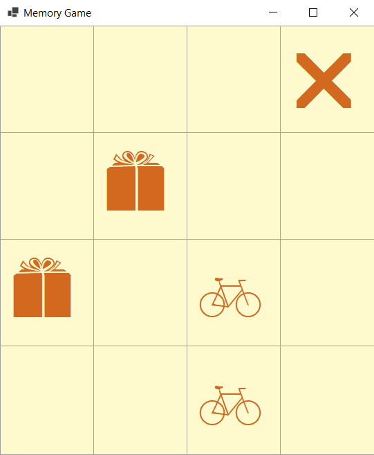

# Memory Game

## Overview
Memory Game is a simple game where players match pairs of icons by clicking on hidden labels. The objective is to match all pairs in the shortest time possible. This project is implemented in C# using Windows Forms.

  

## Features
- Randomized icon distribution to ensure unique gameplay every time.
- Tracks game duration.
- Responsive feedback for correct and incorrect matches.
- Victory notification when all pairs are matched.

## How It Works
1. Icons are randomly assigned to a grid of labels on the game board.
2. Players click on labels to reveal the hidden icon.
3. If two icons match, they remain visible. If they don't, they are hidden after a short delay.
4. The game ends when all pairs are matched.

## How to Run
1. Clone the repository and open the solution file in Visual Studio.
2. Build and run the project / Run the existing build in *bin/Debug/net6.0-windows*)
3. The game window will appear. Start playing by clicking on labels to reveal the icons.

## Requirements
- Windows OS
- .NET Framework
- Visual Studio (for building and running the project)

## Contributing
This project is open-source so feel free to fork this project and submit pull requests for improvements or new features. Suggestions or enhancements are always welcome!
